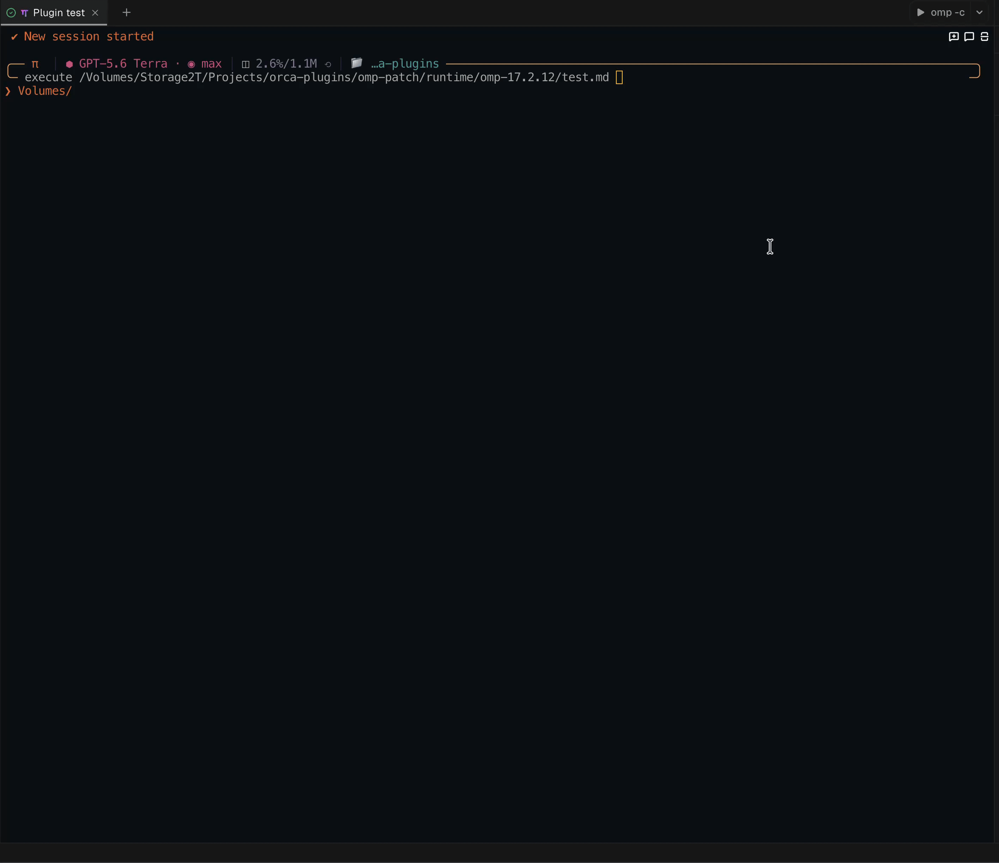

# omp-compact

[English](README.md) · **Русский**


## Установка через Marketplace

Требуется **установленный OMP — [https://omp.sh/](https://omp.sh/)**.

```bash
omp plugin marketplace add arksdev/omp-compact
omp plugin install omp-compact@arksdev
```

Перезапустите OMP, затем откройте настройки плагина командой:

```text
/compact-settings
```

Если меню открылось, плагин загружен. Сам Marketplace добавляется один раз; после этого плагин обновляется командой:

```bash
omp plugin upgrade omp-compact@arksdev
```

## Что делает плагин

Во время большой задачи OMP показывает много отдельных карточек: какие файлы он читал, что искал, какие команды запускал и что редактировал. Через несколько шагов такой журнал становится длинным, и важные изменения в нём сложно заметить.

`omp-compact` делает этот журнал короче и понятнее:

- пока задача выполняется, показывает действия по одной короткой строке и сохраняет их порядок;
- когда OMP закончил отвечать, может убрать временные чтения, поиски и команды;
- оставляет подтверждённые изменения файлов, созданные Git-коммиты и итоговую статистику;
- если задача прервалась или завершилась ошибкой без ответа, ничего диагностически важного не скрывает;
- не заменяет инструменты OMP и не меняет разрешения, выполнение команд или результаты.

Пример во время работы:

```text
Working… read src/index.ts
• read src/index.ts
• grep registerTool in src
• bash: bun test
• write: src/app.ts +17|0
• edit: src/theme.css +2|0
```

После успешного ответа в стандартном режиме `live` остаётся только полезная история:

```text
• write: src/app.ts +17|0
• edit: src/theme.css +2|0
• git commit: 1983fsdf34, a4c12de890
[ 27 actions · 28.2k sent · 1.3k received · 95% cache (480.2k hit) · 1h 20m 32s ]
<assistant answer>
```

## До и после

Одинаковый тип сессии OMP до и после включения `omp-compact`:

### Без omp-compact

[](docs/assets/before.mp4)

[Открыть исходное MP4](docs/assets/before.mp4)

### С omp-compact

[](docs/assets/after.mp4)

[Открыть исходное MP4](docs/assets/after.mp4)

## Три режима

Режим выбирается в `/compact-settings` и фиксируется на весь текущий logical run — от начала работы агента до его финального ответа.

| Режим                 | Пока OMP работает                                       | После успешного ответа                                                            | Для чего подходит                                                |
| --------------------- | ------------------------------------------------------- | --------------------------------------------------------------------------------- | ---------------------------------------------------------------- |
| `compact`             | Все поддерживаемые действия показаны короткими строками | Весь короткий журнал остаётся                                                     | Когда нужна полная история действий без больших native-карточек  |
| `live` — по умолчанию | Тот же полный короткий журнал                           | Остаются изменения файлов, Git summary и статистика; временные действия удаляются | Для обычной работы: видно процесс, но transcript остаётся чистым |
| `clear`               | Обычные строки инструментов скрыты                      | Остаётся ответ и, при включении, статистика                                       | Когда нужен максимально спокойный интерфейс                      |

Unknown, interactive, expanded или несовместимые инструменты остаются в штатном интерфейсе OMP. В любом режиме abort/error без финального ответа сохраняет diagnostic log.

## Дополнительные опции

Все настройки доступны в `/compact-settings`. Plugin-only значения сохраняются в `~/.omp/agent/omp-compact/config.json`; при профиле или `PI_CODING_AGENT_DIR` путь меняется по правилам OMP.

### Короткие имена файлов — `Compact paths`

Когда опция включена, полный путь внутри текущего проекта сокращается:

```text
/Volumes/work/project/src/index.ts:10-20
-> src/index.ts:10-20
```

Меняется только отображение. Плагин не переписывает аргументы инструментов, файлы или сохранённые evidence. Внешние пути, URI, archive/SQLite selectors и небезопасные пути с `..` остаются как есть.

JSON:

```json
{ "compactPaths": true }
```

### Git — `Retain Git rows`

Плагин распознаёт Git по уже выполненным Bash-командам и их результатам. Он не запускает скрытые `git log`, `rev-parse` или другие проверки.

- В `live` Git-действия видны во время работы, а после ответа заменяются одной строкой с подтверждёнными hashes созданных commits.
- Неуспешный commit или commit без hash в итоговую строку не попадает.
- Если выключить опцию, в `live` не будет ни промежуточных Git rows, ни terminal Git summary.
- В `compact` полный короткий Git-журнал сохраняется независимо от этой опции; в `clear` он скрыт вместе с остальными обычными строками.
- Самый последний добавленный коммит из серии коммитов выделяется цветом.

JSON:

```json
{ "retainGitLive": true }
```

### Auto-shake

Auto-shake автоматически вызывает штатный `AgentSession.shake("elide")` после подходящего успешного logical run. Он заменяет тяжёлые старые tool results и крупные блоки короткими placeholders с recovery-ссылкой `artifact://`; это освобождает model context, но не удаляет визуальную историю плагина.

По умолчанию auto-shake **выключен**, а порог при включении равен **120 000 токенов**.

В `/compact-settings`:

1. Включите `Auto-shake`.
2. В `Shake threshold` задайте число токенов. После завершения logical run, если число токенов в текущем контексте больше заданного лимита, автоматически выполнится однократный shake. Чтобы запускать его после каждого logical run, установите лимит `0`.

Пример JSON с порогом 120 000 токенов:

```json
{
  "autoShake": {
    "enabled": true,
    "thresholdTokens": 120000
  }
}
```

Чтобы запускать shake после каждого подходящего logical run:

```json
{
  "autoShake": {
    "enabled": true,
    "thresholdTokens": 0
  }
}
```

`OMP_COMPACT_SHAKE=1` включает auto-shake поверх config, `OMP_COMPACT_SHAKE=0` выключает. Threshold всё равно читается из JSON.

**Отличие от compact-стратегии OMP:** auto-shake не создаёт LLM summary и не заменяет текущую сессию сжатым пересказом. Это хирургическое удаление тяжёлого старого содержимого через `shake("elide")`. Оно запускается только после успешного финального ответа; для subagents, continuation, abort/error или неизвестного token usage при положительном threshold операция пропускается. Если контекст уже превысил лимит, auto-shake не имеет отдельной fallback-стратегии compaction/model switch — дальнейшее восстановление остаётся за штатной context-maintenance конфигурацией OMP.

### Thinking blocks и Recap summary

Эти два переключателя меняют **штатный config OMP**, а не только JSON плагина:

- `Thinking blocks` управляет видимостью reasoning/thinking блоков. Плагин записывает обратное значение в OMP setting `hideThinkingBlock`. Изменение вступает в силу после перезапуска OMP.
- `Recap summary` (в OMP эта настройка называется `Idle Recap`) управляет OMP setting `recap.enabled`. Когда включено, OMP может после периода бездействия сгенерировать краткое резюме текущего состояния. Изменение применяется без перезапуска.

Плагин сначала сохраняет эти значения через live `session.settings` OMP и только затем обновляет их mirror в собственном JSON. Он не вызывает `Settings.init()` и не трогает другие настройки OMP. Если подходящая main session недоступна, в меню будет `n/a`, и host settings не изменятся.

### Статистика

`Run statistics` добавляет одну строку после завершённого run. Отдельно можно включать actions, sent/received tokens, cache hit и elapsed time. Ошибка хотя бы одного инструмента отмечается warning color.

## Безопасное удаление

Сначала можно просто выключить плагин без удаления:

```bash
omp plugin disable omp-compact@arksdev
```

Для полного удаления marketplace-установки:

```bash
omp plugin uninstall omp-compact@arksdev
```

Если плагин был установлен одновременно в user и project scope, удалите нужную копию явно:

```bash
omp plugin uninstall --scope user omp-compact@arksdev
omp plugin uninstall --scope project omp-compact@arksdev
```

После удаления перезапустите OMP. Плагин больше не устанавливает wrappers, и интерфейс полностью возвращается к native OMP. По желанию удалите только его сохранённые настройки:

```bash
rm ~/.omp/agent/omp-compact/config.json
```

Для профиля config находится в `~/.omp/profiles/<name>/agent/omp-compact/config.json`. Удаление этого файла не меняет stock settings `recap.enabled` и `hideThinkingBlock`, потому что они уже сохранены в конфиге OMP. При необходимости верните их через штатные настройки OMP. Marketplace-каталог можно оставить для будущей переустановки или убрать отдельно:

```bash
omp plugin marketplace remove arksdev
```

## Другие способы установки

Из Git checkout:

```bash
git clone https://github.com/arksdev/omp-compact.git
cd omp-compact
bun install --frozen-lockfile
bun run omp
```

`bun run omp` загружает только `./.omp-plugin/index.ts` через `--no-extensions`, чтобы установленная копия плагина не загрузилась второй раз. Для постоянной marketplace/link-установки используйте обычный `omp`, чтобы остальные extensions оставались включены.

Direct launch на один запуск:

```bash
omp -e /absolute/path/to/omp-compact/.omp-plugin/index.ts
```

## Совместимость и документация

Поддерживаемый диапазон — **OMP 17.2.12 и выше**. Release gate закреплён на stock OMP 17.3.1; будущие версии считаются совместимыми, пока не изменят private TUI shape. При таком изменении capability checks fail-open возвращают native rendering — укажите версию OMP и reproduction в GitHub issue.

- [Полная документация](docs/FULL-DOCUMENTATION.md)
- [Конфигурация](docs/CONFIGURATION.md)
- [Архитектура](docs/ARCHITECTURE.md)
- [Разработка](docs/CONTRIBUTING.md)
- [Изменения](CHANGELOG.md)

Проверка repository checkout:

```bash
bun install --frozen-lockfile
bun run check
```

## License

[MIT](LICENSE)
